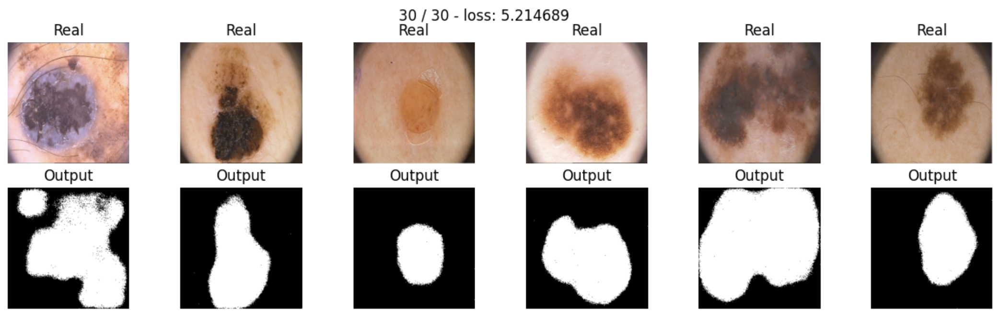

# Skin lesion segmentation with SegNet and UNet.

In this notebook, I implemented and compared different deep learning architectures (SegNet and UNet) for binary segmentation of skin lesions using the PH4 dataset. The models were evaluated using various loss functions (BCE, Dice, and Focal loss), with SegNet using BCE loss achieving the best performance with an IoU of 0.65. 

